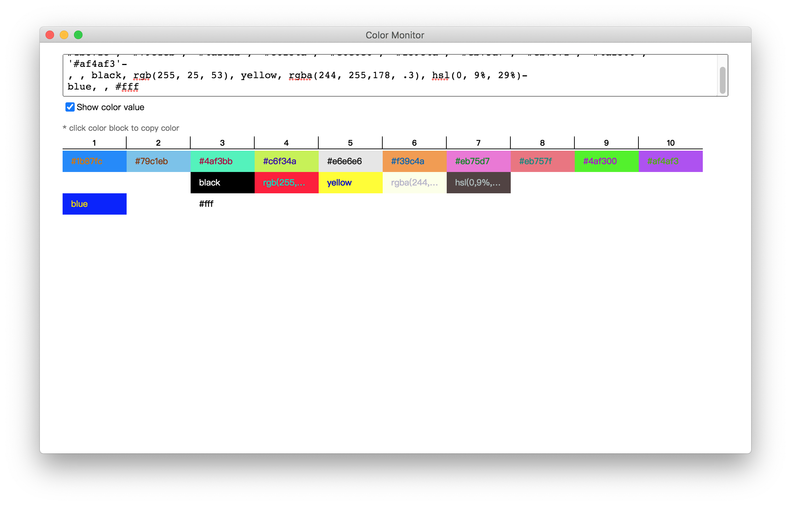

# color-monitor

## About

`Color Monitor` is a simple app which for comparing css colors for front-end developers. If you cannot decide to use which color sometimes, ask `Color Monitor` for help.

Example:


## Features

* Support all valid css types (e.g. `black`/`#fff`/`rgb`/`rgba`/`hsl`)
* Use `-` to change to new line, use `,` to seperate colors
* Auto trim all spaces, tabs, returns, new lines and single quotes (`'`, `\s`, `\n`, `\r`)
* Support copying color to clipboard by clicking

## Project setup
```
npm install
```

### Compiles and hot-reloads for development
```
npm run e:serve
```

### Compiles and minifies for production
```
npm run e:build
```

### Lints and fixes files
```
npm run lint
```
